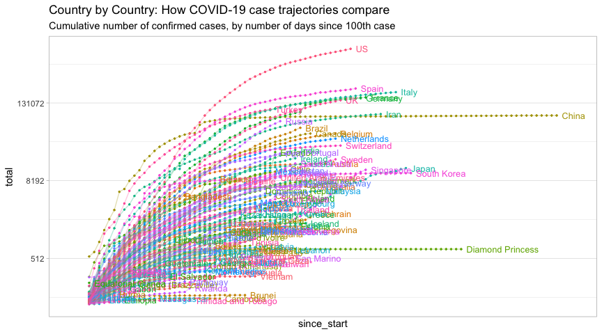

Coronavirus Cases by Region per Capita
================

``` r
library(dplyr)
```

    ## 
    ## Attaching package: 'dplyr'

    ## The following objects are masked from 'package:stats':
    ## 
    ##     filter, lag

    ## The following objects are masked from 'package:base':
    ## 
    ##     intersect, setdiff, setequal, union

``` r
library(magrittr)

load(pins::pin("https://github.com/RamiKrispin/coronavirus/raw/master/data/coronavirus.rda"))

coronavirus <- coronavirus %>%
  mutate(country = `Country.Region`) %>%
  mutate(
    country = case_when(
      country == "United Kingdom" ~ "UK",
      country == "Korea, South" ~ "South Korea",
      TRUE ~ country
    )
  )

coronavirus <- coronavirus %>%
  filter(type == "confirmed") %>%
  group_by(country, date) %>%
  summarise(cases = sum(cases))

since_start <- coronavirus %>%
  group_by(country) %>%
  mutate(total = cumsum(cases)) %>%
  filter(total >= 100) %>%
  group_by(country) %>%
  mutate(since_start = 1:n())
```

``` r
library(ggplot2)
library(directlabels)

# Validate against current chart https://twitter.com/harryrutter/status/1244253749520084992/photo/1
since_start %>%
  ggplot(aes(x = since_start, y = total, color = country)) +
    geom_point(size = 0.5) +
    geom_line(alpha = 0.3) +
    scale_colour_discrete(guide = 'none') +
    scale_x_discrete(expand = c(0, 8)) +
    scale_y_continuous(trans='log2') +
    geom_dl(aes(label = country), method = list(dl.trans(x = x + 0.2), "last.points", cex = 0.8)) +
    ggtitle(label = "Country by Country: How COVID-19 case trajectories compare",
            subtitle = "Cumulative number of confirmed cases, by number of days since 100th case") +
    theme_light()
```

<!-- -->

``` r
population <- read.csv(pins::pin("https://datahub.io/JohnSnowLabs/population-figures-by-country/r/population-figures-by-country-csv.csv"), stringsAsFactors = F)

population <- population %>%
  mutate(
    country = case_when(
      Country == "United States" ~ "US",
      Country == "United Kingdom" ~ "UK",
      Country == "Czech Republic" ~ "Czechia",
      Country == "Iran, Islamic Rep." ~ "Iran",
      Country == "Korea, Rep." ~ "South Korea",
      Country == "Russian Federation" ~ "Russia",
      Country == "Brunei Darussalam" ~ "Brunei",
      Country == "Congo, Rep." ~ "Congo (Kinshasa)",
      Country == "Egypt, Arab Rep." ~ "Egypt",
      Country == "Kyrgyz Republic" ~ "Kyrgyzstan",
      Country == "Macedonia, FYR" ~ "North Macedonia",
      Country == "Slovak Republic" ~ "Slovakia",
      Country == "Venezuela, RB" ~ "Venezuela",
      TRUE ~ Country
    )
  )

population <- transmute(population, country = country, population = Year_2016)

population <- rbind(population, data.frame(
  country = c("Taiwan*", "Diamond Princess"),
  population = c(23780000, 3700)
))

countries <- unique(since_start$country)
countries_missing <- countries[!countries %in% unique(population$country)]
if (length(countries_missing) > 0) stop("Countries missing in population table: ", paste0(countries_missing, collapse = "; "))
```

``` r
covid_since_start <- since_start %>%
  left_join(population, by = "country") %>%
  mutate(total_percent = total / population)

highlight_since_start <- filter(covid_since_start, country %in% c("San Marino", "Andorra", "Iceland", "India", "Luxembourg", "US", "Spain", "Italy", "Japan", "China", "Iran", "UK", "South Korea", "Singapore", "Diamond Princess", "Vietnam", "Taiwan*", "Thailand", "Germany", "France", "Monaco"))

highlight_since_start %>%
  ggplot(aes(x = since_start, y = total_percent, colour = country)) +
    geom_line(aes(group = country), data = covid_since_start, alpha = 0.3, colour = "grey") +
    geom_line(alpha = 0.8) +
    scale_colour_discrete(guide = 'none') +
    scale_x_continuous(limits = c(0, 70)) +
    scale_y_continuous(labels = scales::percent_format(accuracy = 0.0001), trans='log2') +
    geom_dl(aes(label = country), method = list(dl.trans(x = x + 0.2), "last.points", cex = 0.7)) +
    xlab("Number of days since 100th case") + ylab("") +
    labs(title = "Coronavirus Cases by Region per Capita",
         subtitle = "Cumulative number of confirmed cases, divided by population, since 100th case",
         caption = element_text("Source: Johns Hopkins University Center for Systems Science and Engineering. Data Updated: March 28, 2020\nFigure: github.com/javierluraschi/c19chart", color="grey")) +
    theme_bw() + 
    theme(plot.background = element_rect(fill = "#fff1e6"),
          panel.background = element_rect(fill = "#fff1e6",
                                colour = "lightblue",
                                size = 0.5, linetype = "solid"),
          plot.caption = element_text(color="grey60"),
          axis.line.x = element_line(colour = "black"),
          panel.grid.major = element_line(color="grey90"),
          panel.grid.minor = element_line(color="grey90"),
          panel.border = element_blank()) +
    ggsave("covid19-cases-per-capita.png", device = "png", width = 10, height = 5)
```

<!-- -->
